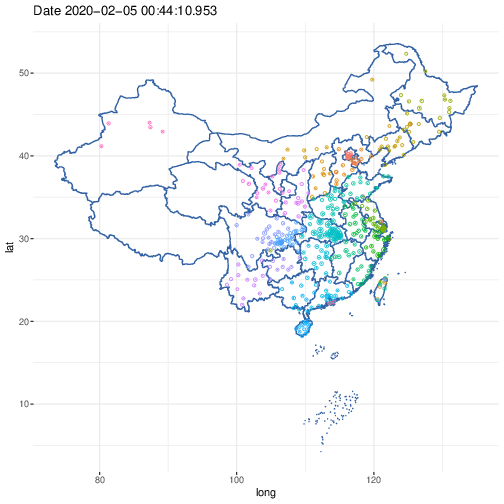

## 获取武汉肺炎疫情统计数据

具体使用方法，请参考<https://mp.weixin.qq.com/s/_0D8ENb-4lGm4UV16Ok28A>.

## GIS

```R
library(mapdata)
library(nCov2019)
data(chinamaps)

data_current = get_nCov2019()
y = plot(data_current, chinamaps)

# Figure 1: By Province - No import 
print(y$val)
# Figure 2: By Size - No import
print(y$val)
```




## Watching

Rscript: `nCov.R`

```R
library(mapdata)
library(nCov2019)
data(chinamaps)
data_current = get_nCov2019()
y = plot(data_current, chinamaps)
time_str = format(Sys.time(), "%Y%b%d_%H")
##TODO: Draw figures into the PDF file
pdf(paste(time_str, '.pdf', sep=''))
# Figure 1: By Province - No import
print(y$val)
# Figure 2: By Size - No import
print(y$val)
dev.off()
##TODO: Raw Data
save.iamge(paste(time_str, '.RData', sep=''))
```

Shell

```
# run every hour
nohup watch -n 3600 Rscrip nCov.R &
```

